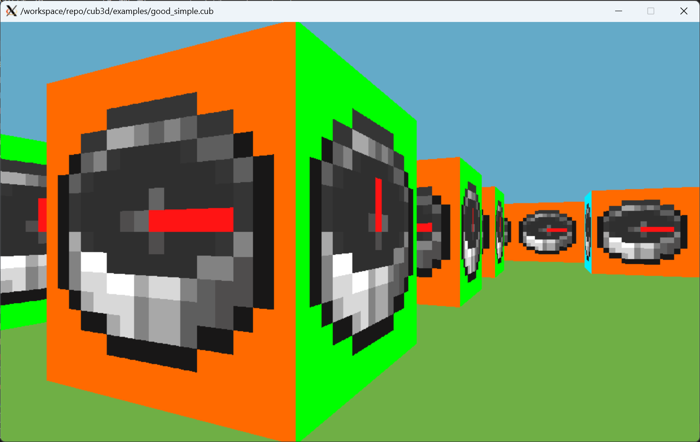

# cub3d
A 3D game engine written in C using the Raycasting technique. Inspired by the game Wolfenstein 3D.



## Installation
```bash
make
```

## Usage
```bash
./cub3D examples/good_simple.cub
```

## Controls
- `W`, `A`, `S`, `D` to move
- `←`, `→` to rotate the camera
- `ESC` to exit the game

## Map
The map is a grid of integers where each number represents a different element:
- `0` for an empty space
- `1` for a wall

## Author
- @GawinGowin (https://github.com/GawinGowin)
- @Sawawa42 (https://github.com/Sawawa42)